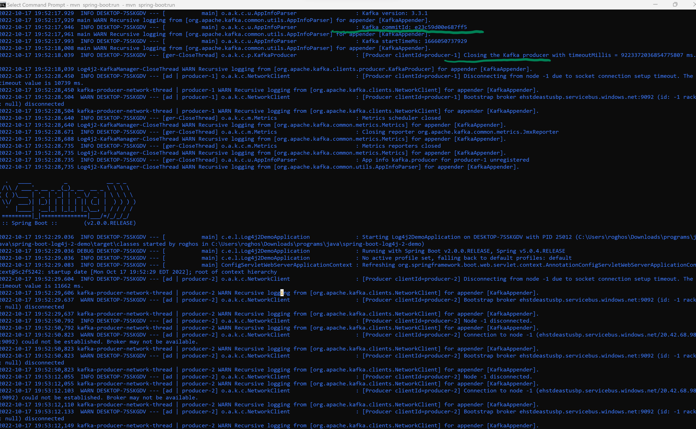

# Sending Application Logs to Azure Event Hub

Azure Event Hub is Microsoft's own Kafka product

There are two ways you can send application logs to Azure Event Hub.
1) If your applications are already running on Azure App Service, you can go to the **Monitoring** section
   of your App instance, go to **Daignostics Settings** then click on **Add diagnostic setting** and choose the log types from the left side and **Event Hub** on the right side as your destination choice.
   (This requires no code changes)
   <br>
   Portal steps here  [Azure Portal](https://github.com/RobinGhosh64/log4j_kafkaappender_to_eventhub/images/app-eh-1.png)
   Portal steps here [Azure Portal](https://github.com/RobinGhosh64/log4j_kafkaappender_to_eventhub/images/app-eh-2.png)
<br>
OR

2) Send application logs directly to Azure Event Hub from your Java application code using standard Log4J appenders. 
   If you are already sending logs to Kafka servers using Log4J appender, replace the connection string parameters in your configuration to point to our Event Hub.
   No further changes are required to your project.
   
   If you are not using log4j appenders and using standard Spring logging only, please update your pom.xml based on this project and add Kafka appender in your log4j settings. The log4j settings can be found in the **src/main/resources/log4j2.xml** file.
   


## Requirements

1. Java - 1.8.x

2. Maven - 3.x.x

## Steps to setup

**1. Clone the application**

```bash
git clone https://github.com/RobinGhosh64/log4j_kafkaappender_to_eventhub.git
```

**2. Build and run the app using maven**

```bash
cd log4j_kafkaappender_to_eventhub
mvn package
java -jar target/log4j2-demo-0.0.1-SNAPSHOT.jar
```

You can also run the app without packaging it using -

```bash
mvn spring-boot:run
```

You should see the following output as shown in the image folders attached. Please verify and make sure you see the Kafka comits and Kafka producer lines in your run



